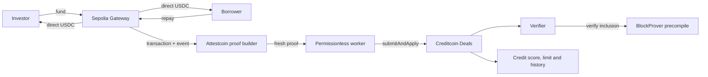

# Cr3dX


**Verified cross-chain credit.** Money moves on Ethereum Sepolia. Credit state
lives on Creditcoin. Attestcoin is the only connection: no trusted relayer,
oracle or backend.

Built for BUIDL CTC 2026 Fall, RWA track.

## Why Cr3dX

Invoice financing is the first use case, not the product. A borrower opens a
deal, a designated investor funds it with Sepolia USDC, and the tokens move
straight to the borrower without escrow. Creditcoin changes the deal and credit
record only after the Sepolia transaction is proven through the Attestcoin
`BlockProver` precompile. Repayment works the same way in reverse.

Cr3dX deliberately separates two concerns:

- **value** moves directly between the parties on Sepolia;
- **credit truth** becomes canonical state and history on Creditcoin.

Remove Attestcoin and Cr3dX cannot decide whether a deal was funded, repaid or
overdue. That dependency is the point of the integration.

## How it works



The worker provides liveness, not authority. Anyone may submit the same proof;
contracts decide what it means, and no worker-only method or role exists.

## Live result

The complete path works on live testnets with no mocked step:

- a deal was opened on Creditcoin, funded by a real Sepolia USDC transfer,
  proven, financed, repaid and closed as `PAID_ON_TIME`;
- the accepted two-run S5 scenario moved the score `500 → 525 → 550`, ended with
  zero exposure and kept two deliberately unfunded deals as 2.2 USDC reserve;
- funding from the wrong investor was proven but classified permanently as
  `WRONG_INVESTOR` rather than changing the deal;
- the S6 worker carried repayment-before-funding through `VERIFIED_PENDING`,
  applied it after funding, and reconciled an external-submission race without a
  worker signature or broadcast for that task;
- Phase B replay matched `63/63` sealed traces: 16 independently derived and 47
  prescribed by the specification.

Exact hashes, blocks, gas, timing and state snapshots are in
[`docs/STATUS.md`](docs/STATUS.md), [`data/live/`](data/live/) and the
[`v0.4.8 verification checkpoint`](docs/verification/v0.4.8-phase-b/README.md).

## Read-only dashboard

The dashboard in [`ui/`](ui/) explains the accepted S6 snapshot and can repeat
public Creditcoin view calls without a wallet, signer or private configuration.
Snapshot and live observation remain visibly separate; failed refreshes cannot
rewrite accepted evidence.

```sh
npm run ui:dev
```

Use `npm run ui:typecheck`, `npm run test:ui` and `npm run ui:build` to verify the
dashboard itself. It has no transaction-submission path, backend, analytics, CDN
or remote fonts.

## Trust boundary

| Cr3dX establishes | Cr3dX does not establish |
|---|---|
| the source transaction was included and succeeded | that an invoice is authentic or legally enforceable |
| a genuine event came from the configured Gateway | the legal identity of a borrower |
| the proven source height determines timeliness | collateral, escrow or repayment enforcement |
| the credit outcome follows from proven facts | Sybil-resistant creditworthiness |

The ERC-20 transfer follows from verified immutable Gateway code, which emits
only after successful `transferFrom`; the Attestcoin proof does not independently
inspect token storage. Cr3dX score is address-level verified repayment reputation.

No owner, pause, upgrade, rescue or administrative correction path exists. The
investor carries the full risk of non-repayment.

Four constraints shape the contract split:

- the Gateway holds no funds and knows nothing about Creditcoin deals;
- the Verifier records immutable source facts but assigns them no business meaning;
- Deals classifies evidence and is the only writer to the constructor-paired
  Credit contract;
- deadlines use attested source height, never Creditcoin time.

## Networks and deployed contracts

| Role | Network | Chain ID |
|---|---|---:|
| Credit state and deployment target | Creditcoin3 Testnet | 102031 |
| Settlement and proof source | Ethereum Sepolia | 11155111 |

The accepted asset is Sepolia USDC at
[`0x1c7D4B196Cb0C7B01d743Fbc6116a902379C7238`](https://sepolia.etherscan.io/address/0x1c7D4B196Cb0C7B01d743Fbc6116a902379C7238),
with 6 decimals. The address, not the symbol, is the security anchor.

| Contract | Network | Address |
|---|---|---|
| `Cr3dXGateway` | Ethereum Sepolia | [`0x11DD8a4c790939DEa8CED631dB27Afe54334a749`](https://sepolia.etherscan.io/address/0x11DD8a4c790939DEa8CED631dB27Afe54334a749) |
| `Cr3dXVerifier` | Creditcoin3 Testnet | [`0xED64f6157408f211dda43649129EaC1F73161093`](https://creditcoin-testnet.blockscout.com/address/0xED64f6157408f211dda43649129EaC1F73161093) |
| `Cr3dXDeals` | Creditcoin3 Testnet | [`0x8f7B944653063f43Bb213CE49517f9Bf9fC6A3cC`](https://creditcoin-testnet.blockscout.com/address/0x8f7B944653063f43Bb213CE49517f9Bf9fC6A3cC) |
| `Cr3dXCredit` | Creditcoin3 Testnet | [`0x4a66732cA5B7f081585693332C79e636CE9c05C8`](https://creditcoin-testnet.blockscout.com/address/0x4a66732cA5B7f081585693332C79e636CE9c05C8) |
| `DoubleFundingFixture` | Ethereum Sepolia | [`0x014B96AB1E09b4F041451787F62A244fA9c180E6`](https://sepolia.etherscan.io/address/0x014B96AB1E09b4F041451787F62A244fA9c180E6) |

`DoubleFundingFixture` is test infrastructure, not part of the product. Canonical
addresses and superseded deployments are recorded in [`deployments/`](deployments/).

## Five-minute local start

Requires Node.js 20 or newer and Foundry. The reproduced baseline uses Node.js
`22.22.1`, npm `9.2.0`, Forge `1.7.1` and Solc `0.8.28`.

```sh
git clone --recurse-submodules https://github.com/Vastargazing/Cr3dX.git
cd Cr3dX
npm ci
export PATH="$HOME/.foundry/bin:$PATH"
npm run build
```

No `.env`, key or network RPC is needed for local development. If Foundry is not
installed, use the [official installer](https://book.getfoundry.sh/getting-started/installation).
If the repository was cloned without submodules, run
`git submodule update --init --recursive`.

Verify the core contract and worker baseline sequentially:

```sh
npm test
npm run test:scripts
npm run typecheck
```

The accepted baseline is 141/141 Foundry tests, including 8 invariant/property
suites, plus 10/10 TypeScript file suites. The invariant run can spend several
minutes without output. During edits, use
`forge test --no-match-path 'test/Cr3dXInvariants.t.sol'` for a faster loop; run
the full three-command baseline before handoff.

## New contributor path

Read in this order:

1. [`docs/WORKFLOW.md`](docs/WORKFLOW.md) for sources of truth and change order.
2. [`docs/cr3dx-spec-v0.4.0-final.md`](docs/cr3dx-spec-v0.4.0-final.md) for
   normative behavior. The filename is historical; the revision inside is v0.4.8.
3. The top of [`docs/STATUS.md`](docs/STATUS.md) for current implementation,
   deployment and acceptance state.
4. Production contracts in order: `Cr3dXGateway` → `Cr3dXVerifier` →
   `Cr3dXDeals` → `Cr3dXCredit`, then their tests.
5. The S5 or S6 runbook only when the task touches live operation.

The README explains the project. The specification defines behavior. `STATUS`
records what was implemented and observed. `docs/verification/` and `docs/audit/`
are evidence and historical review material, not the current task list.

## Repository map

| Path | Purpose |
|---|---|
| `contracts/` | Solidity production perimeter |
| `test/` | Foundry unit, fuzz and invariant coverage |
| `scripts/` | TypeScript probe, capture, deployment and live scenario tooling |
| `worker/` | Permissionless proof worker |
| `ui/` | Read-only dashboard: accepted snapshot plus public RPC observation |
| `deployments/` | Current and superseded live addresses |
| `data/` | Committed probe and live-run evidence |
| `docs/` | Specification, runbooks, measurements, status and verification |
| `assets/` | Project artwork and presentation deck |

## Project links

- [Read-only dashboard](ui/) and its [local run instructions](ui/README.md).
- [Project deck](assets/Cr3dX_RWA_Deck_v1.pptx).
- [S5 live testnet runbook](docs/S5_LIVE_RUNBOOK.md): credentials, preflight,
  state-changing demo, recovery and legacy fixtures.
- [S6 worker runbook](docs/S6_WORKER_RUNBOOK.md) and
  [architecture](docs/S6_WORKER_ARCHITECTURE.md): bootstrap, operation, nonce
  safety and exact-envelope recovery.
- [Attestcoin integration](docs/ATTESTCOIN_INTEGRATION.md): measured protocol
  behavior, proof boundaries and upstream differences.
- [Specification](docs/cr3dx-spec-v0.4.0-final.md),
  [current status](docs/STATUS.md), [verification evidence](docs/verification/)
  and [historical audits](docs/audit/).

The live S1-S5 path is intentionally absent from this README because it sends
transactions and changes testnet state. Use the runbook, read it completely, and
run its read-only preflight before any live command.
